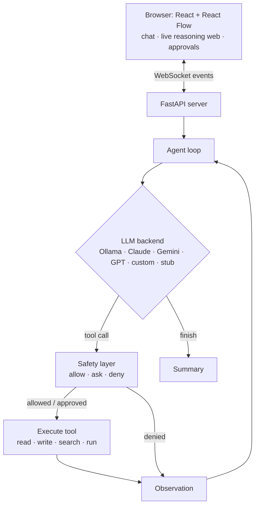

<div align="center">

# 🕷️ Spidey

**A self-hostable AI agent with a live reasoning web — bring your own model (Claude · Gemini · GPT) or run it free and fully offline. Plus a two-stage SFT → DPO pipeline to train its own brain.**

*"With great power comes great responsibility."*

[](https://www.python.org/)
[](web/)
[](spidey/server/)
[](LICENSE)
[](https://ollama.com/)

</div>

Spidey is an autonomous AI assistant that lives on **your** machine: give it a task and it reads files, searches code, writes changes, and runs commands to get it done — while a **live graph in your browser draws every thought and tool call as a node, in real time**. You watch it weave its reasoning web.

<!-- 🎬 DROP THE DEMO GIF HERE — record `spidey serve` → “Run demo” with a screen recorder -->

Three things make it different:

1. **The graphical brain.** `spidey serve` opens a chat + live agent-graph UI (React + React Flow over FastAPI WebSockets). Every step streams in as an animated node — including the safety layer's **Approve / Deny** prompt when the agent wants to run something risky.
2. **Bring your own model.** Works out of the box with **Ollama (free, private, offline)** — or paste your own API key and drive it with **Claude, Gemini, or GPT**. Keys stay in your browser; the server never writes them to disk.
3. **A trainable brain.** A two-stage pipeline — **QLoRA SFT** then **DPO** (Direct Preference Optimization) — teaches a *small free model* to make correct tool-call decisions, with an eval harness to prove the gain. Trains on a free Colab/Kaggle GPU.

---

## Why this exists

Autonomous agents are everywhere in 2026 — and almost all of them are cloud-only black boxes: your data goes to someone else's servers, you pay per token, and you can't see *why* the agent did what it did. Spidey inverts all three: it can run **fully offline on open-weight models**, the reasoning is **drawn live in front of you**, and the model itself is **yours to fine-tune**.

The catch with local models is that small ones are *unreliable at tool-calling* — they narrate instead of acting, or malform the arguments. Spidey attacks that with training, not hope: SFT teaches the format, DPO teaches the **decision** (call the tool, the *right* tool, with *valid* arguments).

## See it in 30 seconds (zero setup)

No model, no GPU, no API key — the demo drives the full stack with a scripted stub:

```bash
git clone https://github.com/Siddharthpatni/Spidey && cd Spidey
pip install -e ".[server]"
spidey serve          # → open http://127.0.0.1:8000 and hit “▶ Run demo”
```

You'll see the chat stream, the reasoning web grow node by node, and the safety layer pause the run for your approval when the agent tries `rm -rf` (it's harmless in the sandboxed demo — that's the point).

Prefer the terminal? `spidey demo` runs the same script as pure text.

## Pick your brain 🧠

| Provider | Cost | Privacy | How |
|---|---|---|---|
| **Ollama** (default) | free | 100% local, works offline | `spidey setup` downloads the model |
| **Claude** (Anthropic) | your key | API | Settings → Claude → paste key (or `ANTHROPIC_API_KEY`) |
| **Gemini** (Google) | your key | API | Settings → Gemini → paste key (or `GEMINI_API_KEY`) |
| **OpenAI** | your key | API | Settings → OpenAI → paste key (or `OPENAI_API_KEY`) |
| **Custom** | — | you decide | any OpenAI-compatible URL (vLLM, llama.cpp, LM Studio…) |
| **Demo** | free | offline | scripted stub, for the tour |

Everyone who uses your Spidey instance sets their **own** model and key in the browser — the config lives in `localStorage`, is sent only over the socket for that run, and is never persisted server-side.

## Fully offline, on your machine

```bash
# 1. Install Ollama:  https://ollama.com/download
# 2. Download the whole model to your machine (one time, ~4.7 GB):
spidey setup

# 3. From then on, no internet required:
spidey run "organize the files in this folder by type" --workdir ~/Downloads
spidey serve
```

## How it works



The agent keeps an OpenAI-style message history, hands the model JSON-schema tools, and loops: **model picks a tool → safety layer checks it → tool runs → result goes back to the model** until it calls `finish`. Every provider quirk lives in a backend ([spidey/llm.py](spidey/llm.py)); every dangerous action lives behind the safety layer ([spidey/safety.py](spidey/safety.py)); every step is emitted as a structured event ([spidey/events.py](spidey/events.py)) that the web UI renders live. The core loop ([spidey/agent.py](spidey/agent.py)) stays deliberately small and readable.

## CLI

```bash
spidey serve                                  # web UI (chat + reasoning web)
spidey setup                                  # download an open model for offline use
spidey run "fix the failing test" \
    --backend ollama --model qwen2.5-coder:7b \
    --workdir ./my-project \                  # sandbox: file tools are confined here
    --safety ask \                            # ask | enforce | off
    --max-steps 25
spidey run "explain this codebase" --backend anthropic   # or gemini / openai / custom
spidey demo                                   # offline terminal demo
```

## The trainable brain: SFT → DPO

Small local models are shaky agents. The [`training/`](training) pipeline fixes that in two stages, both on a **free** Colab/Kaggle GPU:

```bash
pip install -U unsloth trl datasets
python training/finetune.py --epochs 1 --n-synthetic 3000       # stage 1: SFT — learn the format
python training/dpo_finetune.py --adapter outputs --epochs 1    # stage 2: DPO — learn the decision

# Back on your machine:
ollama create spidey-brain -f ./spidey-brain-dpo/Modelfile
spidey run "add type hints to models.py" --model spidey-brain
```

Stage 2 is **Direct Preference Optimization** — the industry-standard preference-alignment method (the closed form of KL-constrained reward maximization under a Bradley–Terry model). Spidey builds its preference pairs from the four failure modes small models actually exhibit: prose-instead-of-call, wrong tool, malformed arguments, hallucinated paths. Details and the math: [training/README.md](training/README.md).

## Does it actually help? (eval)

The [`eval/`](eval) harness scores whether a model calls the **right tool with the right arguments**, so the training is measured, not vibes:

```bash
python eval/run_eval.py --models qwen2.5-coder:3b,spidey-sft,spidey-brain
```

_Illustrative shape of the output — **run it yourself to fill in real numbers** (they depend on your base model, data, and steps):_

| Model | Tool selection | Tool + args |
|-------|:--------------:|:-----------:|
| `qwen2.5-coder:3b` (base) | 7 / 12 | 5 / 12 |
| `spidey-sft` (stage 1)    | 10 / 12 | 8 / 12 |
| `spidey-brain` (stage 2)  | 11 / 12 | 10 / 12 |

## Safety layer

An agent with shell access needs guardrails a confused (or prompt-injected) model can't talk its way past. Spidey's checks live **outside** the model in [spidey/safety.py](spidey/safety.py):

- **Command screening** — destructive patterns (`rm -rf`, `curl | sh`, `sudo`, force-push, secret access, …) are matched before anything runs. `ask` (default) pauses for a human — in the web UI that's the Approve/Deny card; `enforce` blocks outright; `off` exists but don't.
- **Path confinement** — file tools can't escape the working directory, so the agent can't read your `~/.ssh` keys or write to `/etc`.

## Project layout

```
Spidey/
├── spidey/            # the agent package (Python)
│   ├── agent.py       #   the ReAct tool-calling loop
│   ├── events.py      #   structured events every frontend consumes
│   ├── llm.py         #   Ollama · Anthropic · Gemini · OpenAI · custom · stub backends
│   ├── tools.py       #   read, write, list, search, run, finish
│   ├── safety.py      #   command screening + path confinement
│   ├── cli.py         #   spidey serve | setup | run | demo
│   └── server/        #   FastAPI + WebSocket bridge (+ built UI in static/)
├── web/               # React + Vite + Tailwind + React Flow frontend
├── training/          # stage 1 SFT + stage 2 DPO → GGUF → Ollama (free GPU)
├── eval/              # tool-selection accuracy: base vs SFT vs DPO
└── examples/          # the zero-setup offline demo
```

## Deploying it (optional)

Spidey is self-hosted by design — `spidey serve` on your laptop is the intended deployment. To put the UI on a small cloud box (Railway, Render, Fly.io) for yourself, use the included [Dockerfile](Dockerfile); users then bring their own API keys through the browser as usual. Don't expose it publicly without adding auth — it's an agent with shell access.

## Roadmap

- [ ] Multi-file planning step for larger tasks
- [ ] More tools (apply-patch/diff editing, container sandbox for `run_command`)
- [ ] Persistent memory across sessions
- [ ] Stage 3: GRPO with the eval harness as a verifiable reward
- [ ] Session history + shareable run replays in the web UI

## Contributing

Issues and PRs welcome. Good first contributions: a new tool, a new safety rule, more eval tasks, a provider backend. Please run `spidey demo` and the eval before opening a PR.

## Credits

Built on the shoulders of [Ollama](https://ollama.com/), [Unsloth](https://github.com/unslothai/unsloth), [TRL](https://github.com/huggingface/trl), [React Flow](https://reactflow.dev/), [FastAPI](https://fastapi.tiangolo.com/), and the open-weight model community.

## License

[MIT](LICENSE) — do what you like, no warranty.
