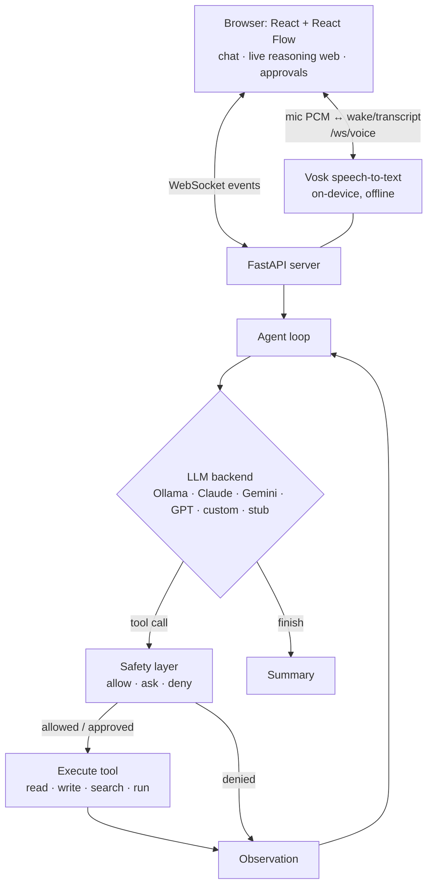

<div align="center">



# 🕷️ Spidey

**A self-hostable AI agent with a live reasoning web · bring your own model (Claude · Gemini · GPT) or run it free and fully offline. Plus a two-stage SFT → DPO pipeline to train its own brain.**

> *"With great power comes great responsibility."*

[](https://github.com/Siddharthpatni/Spidey/actions/workflows/ci.yml)
[](https://www.python.org/)
[](web/)
[](spidey/server/)
[](https://ollama.com/)
[](LICENSE)

</div>

Spidey is an autonomous AI assistant that lives on **your** machine: give it a task and it reads files, searches code, writes changes, and runs commands to get it done — while a **live graph in your browser draws every thought and tool call as a node, in real time**. You watch it weave its reasoning web.

<!-- 🎬 DROP THE DEMO GIF HERE — record `spidey serve` running a real task with a screen recorder -->

Five things make it different:

0. **It knows you.** A local long-term memory (`~/.spidey/memory.md` — a plain
   markdown file *you* own and can edit) plus in-conversation continuity: tell it
   your name once and it greets you by it next week, fully offline. The `remember`
   tool saves what a good friend would remember.

1. **The graphical brain.** `spidey serve` opens a chat + live agent-graph UI (React + React Flow over FastAPI WebSockets). Every step streams in as an animated node — including the safety layer's **Approve / Deny** prompt when the agent wants to run something risky.
2. **"Hey Spidey" — voice, fully on-device.** Turn on the mic and just talk: an offline wake word + speech-to-text (Vosk, running on *your* machine) hears the task, and replies are spoken with your OS's local voices. No audio ever leaves the device.
3. **Bring your own model.** Works out of the box with **Ollama (free, private, offline)** — or paste your own API key and drive it with **Claude, Gemini, or GPT**. Keys stay in your browser; the server never writes them to disk.
4. **A trainable brain.** A two-stage pipeline — **QLoRA SFT** then **DPO** (Direct Preference Optimization) — teaches a *small free model* to make correct tool-call decisions, with an eval harness to prove the gain. Trains on a free Colab/Kaggle GPU.

---

## Why this exists

Autonomous agents are everywhere in 2026 — and almost all of them are cloud-only black boxes: your data goes to someone else's servers, you pay per token, and you can't see *why* the agent did what it did. Spidey inverts all three: it can run **fully offline on open-weight models**, the reasoning is **drawn live in front of you**, and the model itself is **yours to fine-tune**.

The catch with local models is that small ones are *unreliable at tool-calling* — they narrate instead of acting, or malform the arguments. Spidey attacks that with training, not hope: SFT teaches the format, DPO teaches the **decision** (call the tool, the *right* tool, with *valid* arguments).

## Get running (two commands + one download)

```bash
git clone https://github.com/Siddharthpatni/Spidey && cd Spidey
pip install -e ".[server,voice]"
spidey setup          # one-time: pulls Gemma 4 to your machine via Ollama
spidey serve          # → open http://127.0.0.1:8000 and give it a task
```

You'll see the chat stream, the reasoning web grow node by node, and the safety layer
pause for your approval whenever the agent wants to run something risky. Already have
an API key instead? Skip `spidey setup`, open ⚙ Settings and pick Claude, Gemini or
OpenAI — key stays in your browser.

## Pick your brain 🧠

| Provider | Cost | Privacy | How |
|---|---|---|---|
| **Ollama** (default) | free | 100% local, works offline | `spidey setup` downloads the model |
| **Claude** (Anthropic) | your key | API | Settings → Claude → paste key (or `ANTHROPIC_API_KEY`) |
| **Gemini** (Google) | your key | API | Settings → Gemini → paste key (or `GEMINI_API_KEY`) |
| **OpenAI** | your key | API | Settings → OpenAI → paste key (or `OPENAI_API_KEY`) |
| **Custom** | — | you decide | any OpenAI-compatible URL (vLLM, llama.cpp, LM Studio…) |

Everyone who uses your Spidey instance sets their **own** model and key in the browser — the config lives in `localStorage`, is sent only over the socket for that run, and is never persisted server-side.

**Which local model?** The Settings panel suggests these (all free, open-weight, and
**fully offline** once pulled — the weights live on your disk, nothing phones home):

| Tag | Size | Why |
|---|---|---|
| `gemma4:12b` | ~7.6 GB | **the default.** Google's [Gemma 4](https://deepmind.google/models/gemma/gemma-4/) (Apache 2.0, Apr 2026) — built for agentic workflows with *native function-calling*, 256K context |
| `gemma4:e4b` / `gemma4:e2b` | ~9.6 / ~7.2 GB | Gemma 4 edge variants (4.5B / 2.3B effective) for lighter machines |
| `qwen2.5-coder:7b` | ~4.7 GB | strong coding-focused tool-caller |
| `llama3.1:8b` | ~4.9 GB | strong general assistant |
| `qwen2.5-coder:1.5b` | ~1 GB | tiny; old laptops and experiments |

*Is Gemma "fully offline"? The Gemma models are — they're open-weight downloads (unlike
Gemini, which is a cloud API). `spidey setup` pulls the weights once; after that the
network cable can stay unplugged.*

Honesty clause: a ~10B model on your laptop is not Claude or Gemini-cloud — but Gemma 4
closes a lot of that gap for tool-calling, and tuned with the [training pipeline](training/)
a small model gets *reliable* at exactly the thing an agent needs (calling the right tool
with valid arguments), at zero cost and with zero data sharing.

## Fully offline, on your machine

```bash
# 1. Install Ollama:  https://ollama.com/download
# 2. Download the whole model to your machine (one time, ~7.6 GB — Gemma 4 12B):
spidey setup                       # or: spidey setup --model gemma4:e2b (smaller)

# 3. From then on, no internet required:
spidey run "organize the files in this folder by type" --workdir ~/Downloads
spidey serve
```

## 🎙 Say "Hey Spidey" — offline voice

```bash
pip install -e ".[voice]"     # vosk: a small on-device speech recognizer
spidey setup --voice          # one-time ~40 MB model download
spidey serve                  # click the mic → say "Hey Spidey, …"
```

Then it's hands-free: **"Hey Spidey — list the files in my downloads folder."**
A chime confirms the wake word, your words appear live as you speak, the agent runs,
and the answer is **spoken back** with your OS's built-in voices. When the safety layer
needs a verdict you can just say *"approve"* or *"deny"*.

Privacy model, precisely: the browser streams mic audio **only to your own server**
(the same machine, over the local WebSocket), where Vosk transcribes it in-process.
Wake-word detection, speech-to-text and text-to-speech all work with the network
cable unplugged. There is no cloud speech API anywhere in the loop.

📚 **The full offline story** — every component, exact RAM needs, what touches the
internet and when — lives in [docs/OFFLINE.md](docs/OFFLINE.md).

## How it works



The agent keeps an OpenAI-style message history, hands the model JSON-schema tools, and loops: **model picks a tool → safety layer checks it → tool runs → result goes back to the model** until it calls `finish`. Every provider quirk lives in a backend ([spidey/llm.py](spidey/llm.py)); every dangerous action lives behind the safety layer ([spidey/safety.py](spidey/safety.py)); every step is emitted as a structured event ([spidey/events.py](spidey/events.py)) that the web UI renders live. The core loop ([spidey/agent.py](spidey/agent.py)) stays deliberately small and readable.

## CLI

```bash
spidey serve                                  # web UI (chat + reasoning web + voice)
spidey setup                                  # download an open model for offline use
spidey setup --voice                          # download the offline speech model (~40 MB)
spidey run "fix the failing test" \
    --backend ollama --model gemma4:12b \
    --workdir ./my-project \                  # sandbox: file tools are confined here
    --safety ask \                            # ask | enforce | off
    --max-steps 25
spidey run "explain this codebase" --backend anthropic   # or gemini / openai / custom
```

## The trainable brain: SFT → DPO

Small local models are shaky agents. The [`training/`](training) pipeline fixes that in two stages, both on a **free** Colab/Kaggle GPU:

```bash
pip install -U unsloth trl datasets
python training/finetune.py --epochs 1 --n-synthetic 3000       # stage 1: SFT — learn the format
python training/dpo_finetune.py --adapter outputs --epochs 1    # stage 2: DPO — learn the decision

# Back on your machine:
ollama create spidey-brain -f ./spidey-brain-dpo/Modelfile
spidey run "add type hints to models.py" --model spidey-brain
```

Stage 2 is **Direct Preference Optimization** — the industry-standard preference-alignment method (the closed form of KL-constrained reward maximization under a Bradley–Terry model). Spidey builds its preference pairs from the four failure modes small models actually exhibit: prose-instead-of-call, wrong tool, malformed arguments, hallucinated paths. Details and the math: [training/README.md](training/README.md).

## Does it actually help? (eval)

The [`eval/`](eval) harness scores whether a model calls the **right tool with the right arguments**, so the training is measured, not vibes:

```bash
python eval/run_eval.py --models qwen2.5-coder:3b,spidey-sft,spidey-brain
```

_Illustrative shape of the output — **run it yourself to fill in real numbers** (they depend on your base model, data, and steps):_

| Model | Tool selection | Tool + args |
|-------|:--------------:|:-----------:|
| `qwen2.5-coder:3b` (base) | 7 / 12 | 5 / 12 |
| `spidey-sft` (stage 1)    | 10 / 12 | 8 / 12 |
| `spidey-brain` (stage 2)  | 11 / 12 | 10 / 12 |

## Safety layer

An agent with shell access needs guardrails a confused (or prompt-injected) model can't talk its way past. Spidey's checks live **outside** the model in [spidey/safety.py](spidey/safety.py):

- **Command screening** — destructive patterns (`rm -rf`, `curl | sh`, `sudo`, force-push, secret access, …) are matched before anything runs. `ask` (default) pauses for a human — in the web UI that's the Approve/Deny card; `enforce` blocks outright; `off` exists but don't.
- **Path confinement** — file tools can't escape the working directory, so the agent can't read your `~/.ssh` keys or write to `/etc`.

## Project layout

```
Spidey/
├── spidey/            # the agent package (Python)
│   ├── agent.py       #   the ReAct tool-calling loop
│   ├── events.py      #   structured events every frontend consumes
│   ├── llm.py         #   Ollama · Anthropic · Gemini · OpenAI · custom · stub backends
│   ├── tools.py       #   read, write, list, search, run, finish
│   ├── safety.py      #   command screening + path confinement
│   ├── cli.py         #   spidey serve | setup | run
│   └── server/        #   FastAPI + WebSocket bridge (+ built UI in static/)
│   ├── voice.py       #   offline wake word + speech-to-text (Vosk, on-device)
├── web/               # React + Vite + Tailwind + React Flow frontend (chat · graph · voice)
├── training/          # stage 1 SFT + stage 2 DPO → GGUF → Ollama (free GPU)
└── eval/              # tool-selection accuracy: base vs SFT vs DPO
```

## 📱 On your phone — no app store needed

The web UI **is** the app: fully responsive on phones (chat and the reasoning web
become tabs) and installable — open your server's URL once, *Add to Home Screen*,
and Spidey launches fullscreen with its own icon. For voice from the phone, start
the server with `--https` (one flag; the mic needs a secure page). Details in
[docs/OFFLINE.md](docs/OFFLINE.md).

## 📚 Documentation

| Doc | What's inside |
|---|---|
| [docs/ARCHITECTURE.md](docs/ARCHITECTURE.md) | full system design with diagrams — agent loop, event stream, voice pipeline, persona layers, training flow |
| [docs/API.md](docs/API.md) | the complete wire protocol (`/ws`, `/ws/voice`, auth) — build your own client |
| [docs/SECURITY.md](docs/SECURITY.md) | threat model, safety layer, token auth, privacy table, deployment guidance |
| [docs/OFFLINE.md](docs/OFFLINE.md) | the offline story: models, RAM needs, exactly what touches the internet |
| [training/README.md](training/README.md) | SFT → DPO math, persona training, base models, Colab recipes |

## Deploying it (optional)

Spidey is self-hosted by design — `spidey serve` on your laptop is the intended deployment. Reaching it from other devices? Require a token:

```bash
spidey serve --host 0.0.0.0 --token $(openssl rand -hex 16)
# open http://<your-ip>:8000/?token=<that token> — the UI remembers it
```

To put it on a small cloud box (Railway, Render, Fly.io) for yourself, use the included [Dockerfile](Dockerfile) with `$SPIDEY_TOKEN` set and TLS in front. It's an agent with shell access — read [docs/SECURITY.md](docs/SECURITY.md) before exposing anything.

## Roadmap

- [ ] Multi-file planning step for larger tasks
- [ ] More tools (apply-patch/diff editing, container sandbox for `run_command`)
- [ ] Persistent memory across sessions
- [ ] Stage 3: GRPO with the eval harness as a verifiable reward
- [ ] Distillation recipe: Gemini/Claude as teacher for DPO pairs (see training/README)
- [ ] Session history + shareable run replays in the web UI

## Contributing

Issues and PRs welcome. Good first contributions: a new tool, a new safety rule, more eval tasks, a provider backend. Please verify with a real local run (`spidey run … --model <your ollama tag>`) and the eval before opening a PR.

## Credits

Built on the shoulders of [Ollama](https://ollama.com/), [Unsloth](https://github.com/unslothai/unsloth), [TRL](https://github.com/huggingface/trl), [React Flow](https://reactflow.dev/), [FastAPI](https://fastapi.tiangolo.com/), and the open-weight model community.

## License

[MIT](LICENSE) — do what you like, no warranty.
