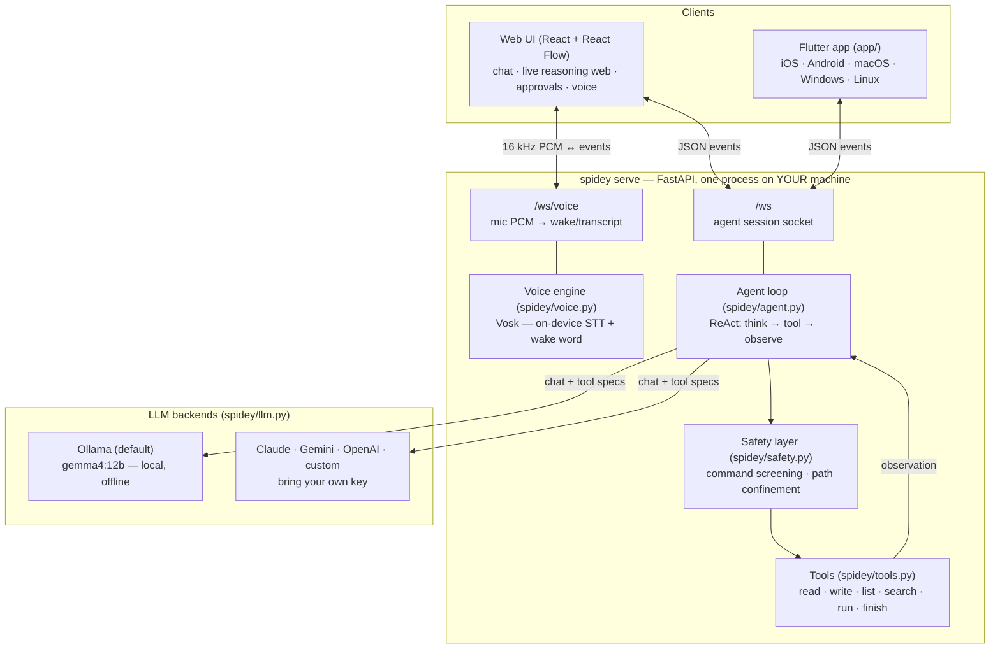
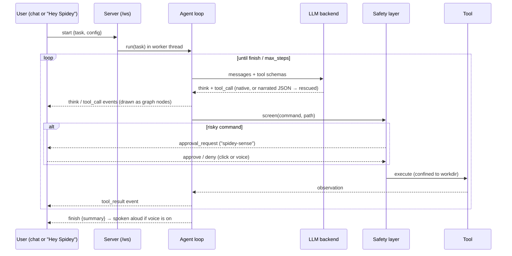
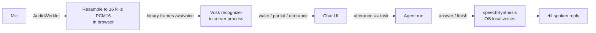
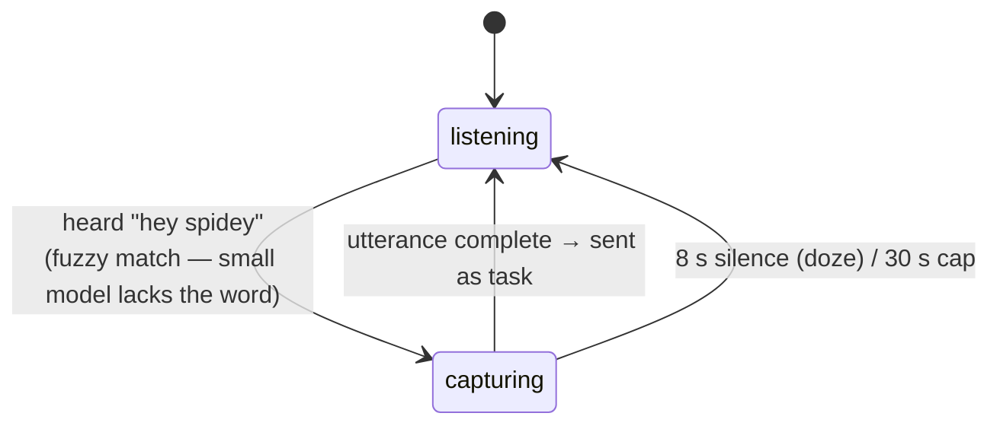
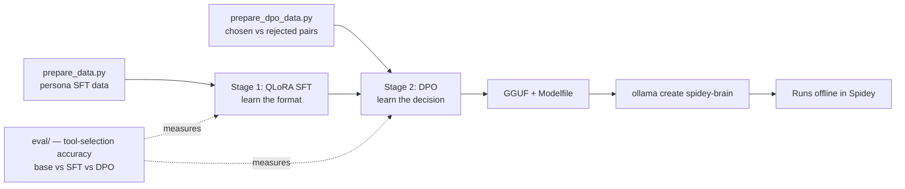

# 🕷️ Spidey Architecture

How the whole system fits together: the agent loop, the event stream, the web UI,
offline voice, the safety layer, and the training pipeline. Companion references:
[API.md](API.md) (wire protocol), [SECURITY.md](SECURITY.md) (threat model & auth),
[OFFLINE.md](OFFLINE.md) (what runs where).

## System overview

Design rule: **every provider quirk lives in a backend; every dangerous action lives
behind the safety layer; every step is a structured event.** The agent loop itself
([spidey/agent.py](../spidey/agent.py)) stays small enough to read in one sitting.

## One run, end to end

The run executes in a worker thread; events cross into the async world via a
thread-safe queue, and approvals block the thread on a `Future` the browser
resolves (`APPROVAL_TIMEOUT` = 300 s, deny on timeout).

## The reasoning web

The UI derives **two views from one event stream** (`web/src/useSpideySocket.js`):
the chat panel and the graph. Each `think`/`tool_call`/`finish` event becomes a
node; edges follow event order; node status updates in place (`running → ok/err`,
`awaiting` while an approval is pending). Clicking a node shows the exact tool
arguments and full observation — nothing is hidden.

## Small-model robustness (why it works offline)

Small local models fail at tool-calling in known ways. Spidey attacks each one:

| Failure mode | Countermeasure |
|---|---|
| Narrates the call as JSON text instead of calling | **Rescue parser** in the loop (`_rescue_tool_call`): detects a narrated `{"name": …, "arguments": …}` and executes it — found and fixed by testing on a real 1.5B model |
| Wrong tool / hallucinated tool | DPO stage trains the *decision* on chosen/rejected pairs |
| Malformed arguments (`filename` vs `path`) | SFT teaches the exact schema; DPO punishes bad-args pairs |
| Answers with prose when it should act | SFT persona-chat examples teach the boundary both ways |

Gemma 4 (the default) has **native function-calling** and needs none of this in
practice; the rescue path is what makes 1–3 B models usable.

## Offline voice pipeline

Wake-word state machine (`spidey/voice.py`), time measured in **audio fed**, not
wall clock, so slow networks can't cut speech off:

Extras that fell out of hands-free use: the UI mutes the mic while Spidey speaks
(no self-triggering), a chime confirms the wake word, and during an approval you
can answer **"approve"/"deny"** — or say **"stop"** to cancel a run.

## The persona (Spider-Man, in three layers)

1. **Runtime** — the system prompt carries Peter Parker's voice *and* maps the
   philosophy to agent behavior: great power → smallest action that works, look
   before you touch, reversible over destructive, safety layer = spidey-sense.
2. **Training** — every SFT example is conditioned on a compact persona prompt;
   ~8% are in-character exchanges that also teach "pure questions get prose".
3. **Guardrail** — personality is confined to commentary and summaries; tool
   arguments (paths, commands, code) are always literal. DPO stays persona-neutral
   so decision training stays clean.

## Training pipeline (the trainable brain)

The math (Bradley–Terry preference model, KL-constrained reward maximization) is
derived in [training/README.md](../training/README.md). Both stages run on a free
Colab/Kaggle GPU.

## How this is tested

No mocked model behavior. The repo's bar for "works" is the **real stack**:

- a real Ollama model driven from the CLI and from the browser UI (Playwright),
  checking actual files written to disk;
- real synthesized speech fed through the wake-word engine and over `/ws/voice`;
- auth checked by connecting with no/wrong/right tokens against a live server.

CI ([.github/workflows/ci.yml](../.github/workflows/ci.yml)) covers what a GPU-less
runner can honestly verify: compilation, server boot, route presence, both training
data generators, and the production web build.
