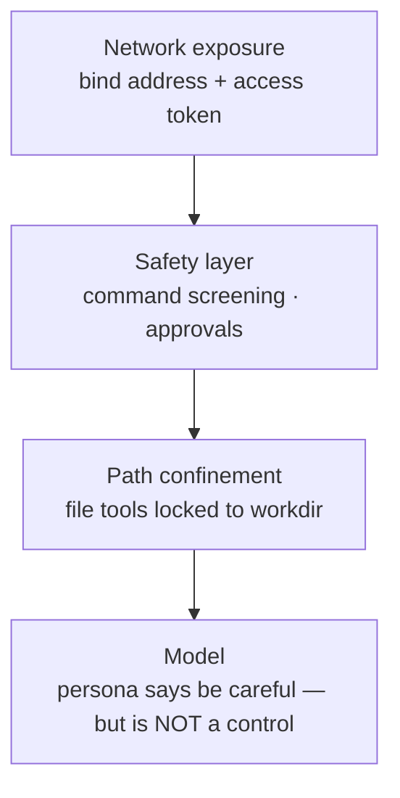

# 🕷️ Spidey security model

Spidey is an agent with **shell access to the machine it runs on**. That sentence
should set your posture: treat the server like SSH, not like a web page.

## Layers, outermost first

**The model is not a security boundary.** Prompts (including the Spider-Man
persona's "responsibility" rules) shape behavior; they cannot enforce it. Every
guarantee below is code the model can't talk its way past.

### 1. Network exposure

- Default bind is `127.0.0.1` — only you.
- `spidey serve --token <secret>` (or `$SPIDEY_TOKEN`) requires the token on every
  WebSocket; wrong/missing → one explanatory error event, then close **1008**.
  Comparison uses `secrets.compare_digest` (no timing leak).
- The server warns loudly if started on a non-localhost bind without a token.
- Going beyond a trusted LAN? Put TLS in front (Caddy/Traefik/nginx) so the token
  and your API keys aren't readable on the wire. **Never** port-forward a
  token-less Spidey to the internet.

### 2. Safety layer (`spidey/safety.py`)

Three modes, chosen per run: `ask` (default — risky commands pause for a human
verdict), `enforce` (risky commands are blocked outright), `off` (trusted,
isolated environments only). Screening flags destructive patterns —
`rm -rf`, `sudo`, disk-wide operations, pipes-to-shell, and friends — before the
command ever reaches a shell. Approvals arrive in the UI (and are spoken, if
voice is on); a run waits at most 300 s for a verdict, then denies.

### 3. Path confinement (`spidey/tools.py`)

File tools resolve every path against the working directory and refuse to escape
it — the agent can't read `~/.ssh` or write `/etc/…` no matter what the task says.
Note the honest limit: `run_command` executes in the workdir but a shell command
is inherently less confinable than file tools — that's exactly why the safety
layer screens commands and why `ask` is the default.

## Privacy model

| Data | Where it goes |
|---|---|
| Your files & tasks | stay on the machine running `spidey serve` (with Ollama: nothing leaves at all) |
| Cloud API keys | browser `localStorage` → sent per-run over the socket → held in memory for that run — never written server-side |
| Microphone audio | browser → your own server over localhost/LAN → transcribed in-process by Vosk → discarded; no cloud STT, no recordings |
| Spoken replies | synthesized by the OS's local voices |
| Telemetry | none. Spidey has no analytics, no phone-home, no update pings |

## Deployment guidance

| Scenario | Do |
|---|---|
| Personal laptop | defaults are right (`127.0.0.1`, no token needed) |
| LAN / phone via Wi-Fi | `spidey serve --host 0.0.0.0 --token $(openssl rand -hex 16)` — share the `?token=` URL |
| Small cloud box for yourself | Dockerfile + token + TLS reverse proxy; keep `--safety ask` |
| Public multi-user service | **don't** — Spidey is single-trust-domain by design; there is no user isolation |

## Reporting

Found a hole? Open a GitHub issue (or email the address in `pyproject.toml`) with
a repro. Command-screening bypasses and path-confinement escapes are the highest-
value reports.
